https://skateshack.herokuapp.com/

## User Experience (UX)

### Strategy


### Project Goals

- A website that is fully responsive and will work on screens of all sizes.

- An easy to navigate structure for a painless user experience.

- An attractive design.

- The ability to create an account.

- An overall easy experience for a customer.


### User Stories

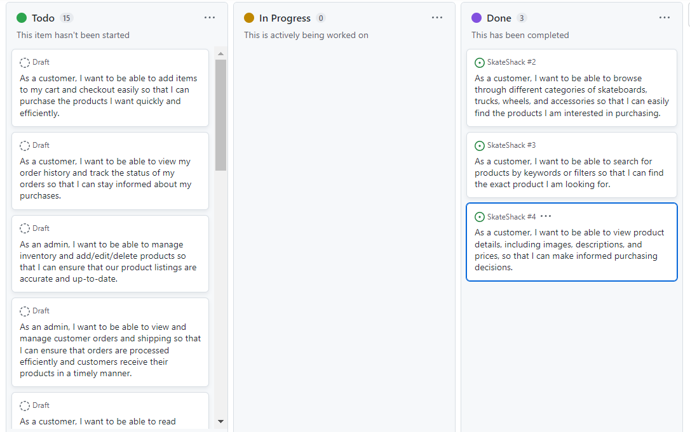
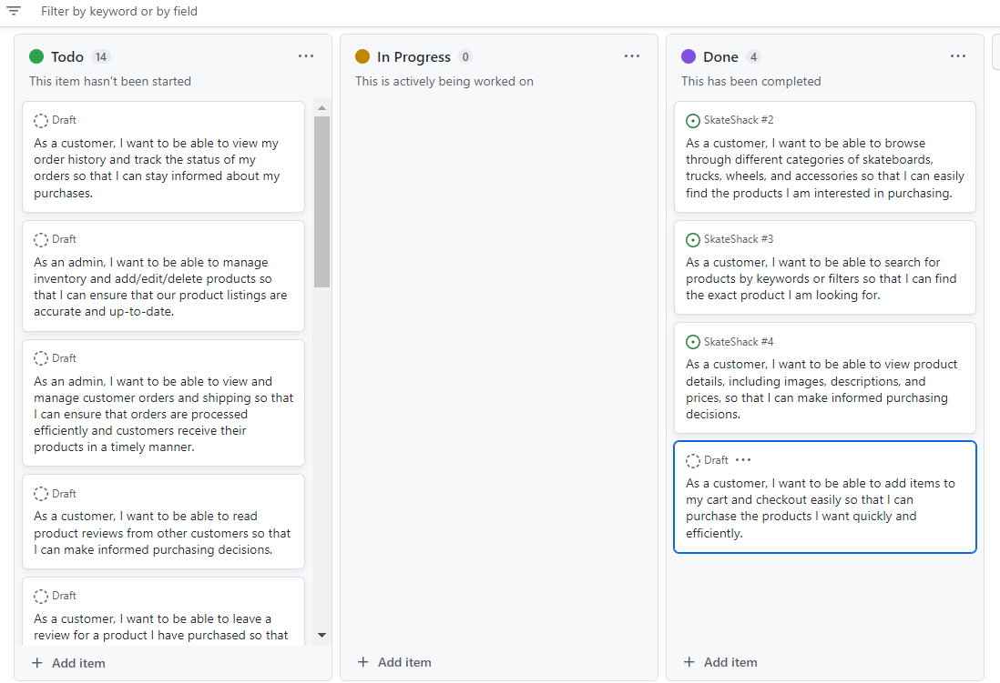
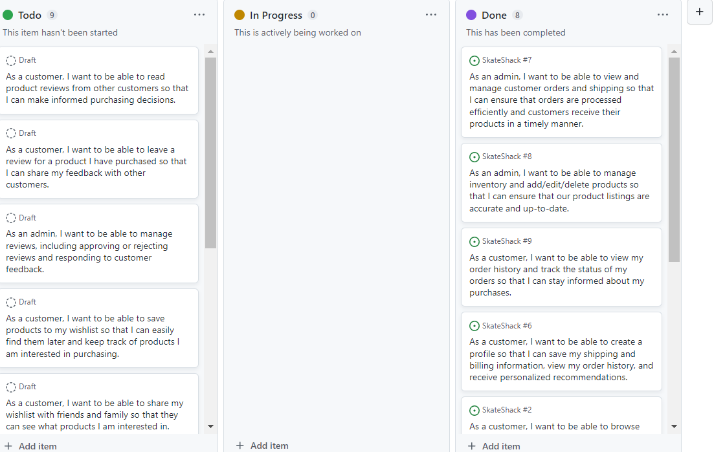
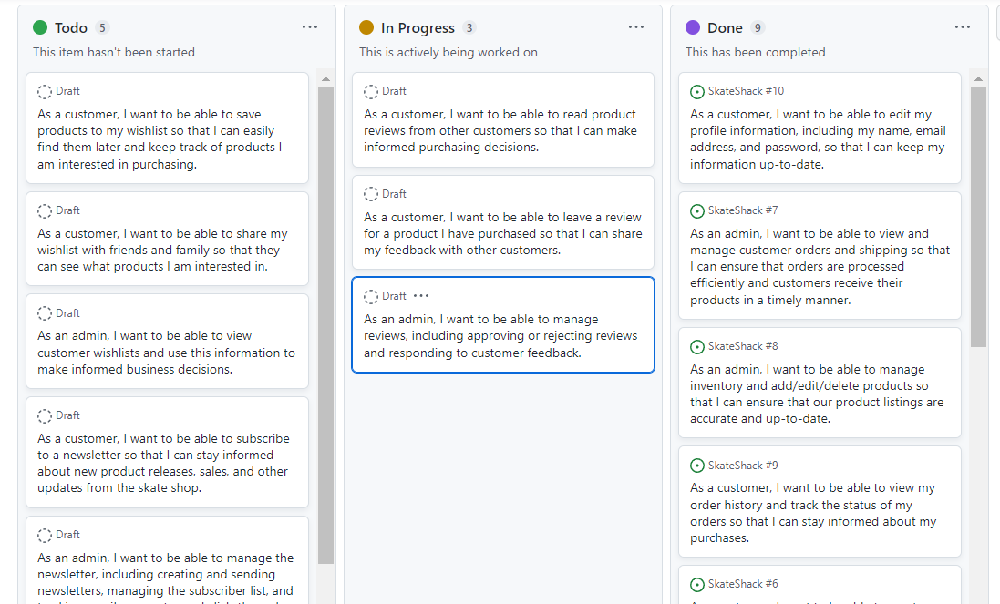

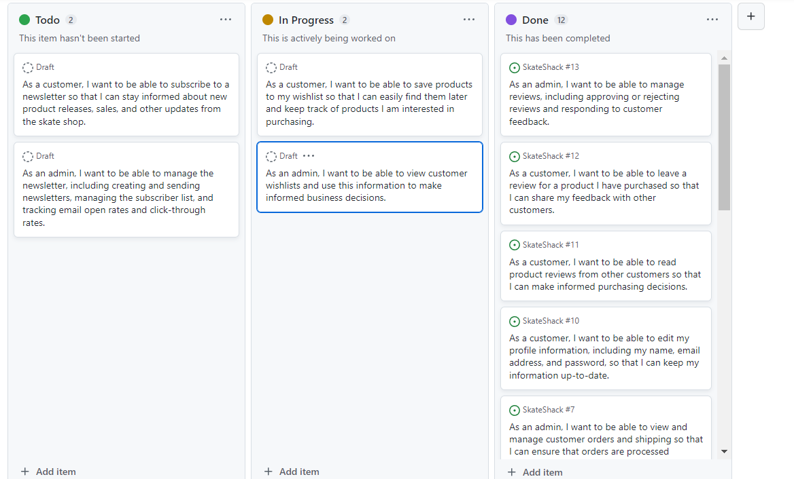

### Structure

insert heirarchy 

- Header, footer and navigation bar are consistent through all pages.

- Links and forms provide clear feedback to the site user.

- New additional content features are provided for the user once they register an account.
 
- A 404-error page is available.


### Database Model

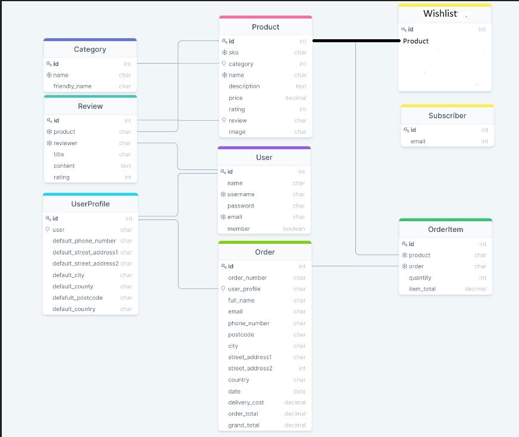

### Skeleton

- wireframes

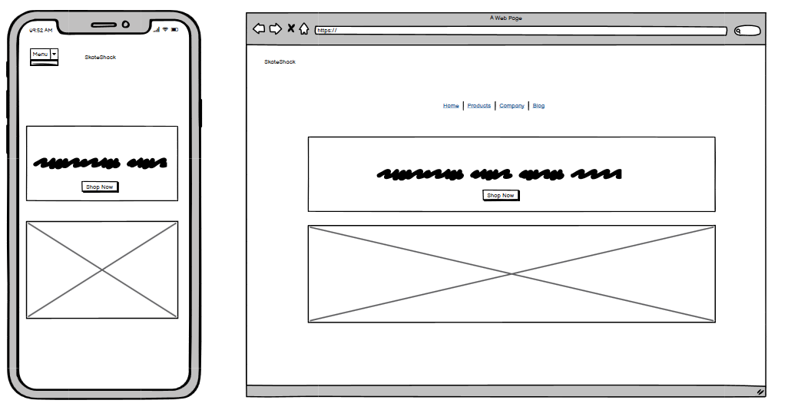
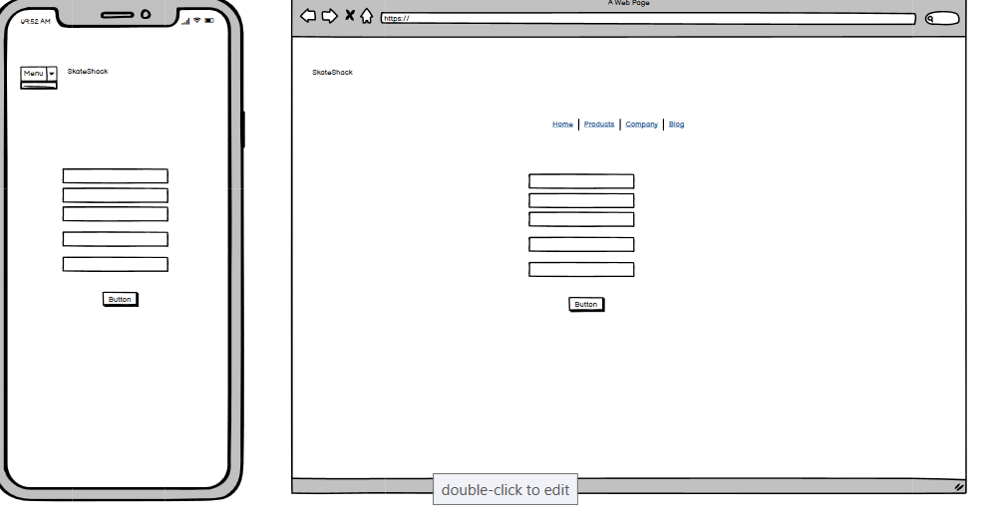
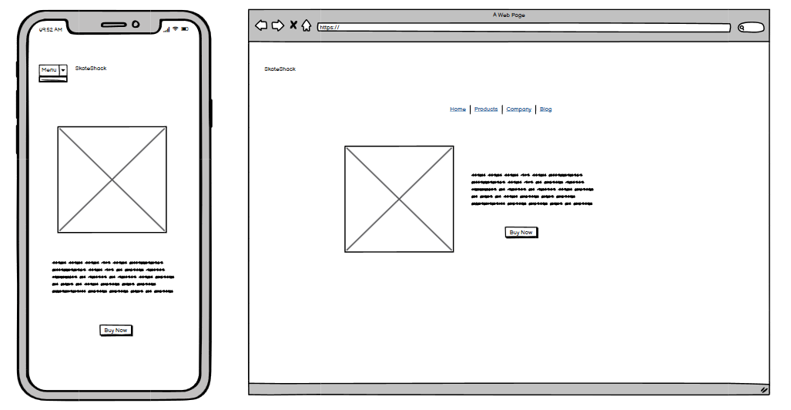
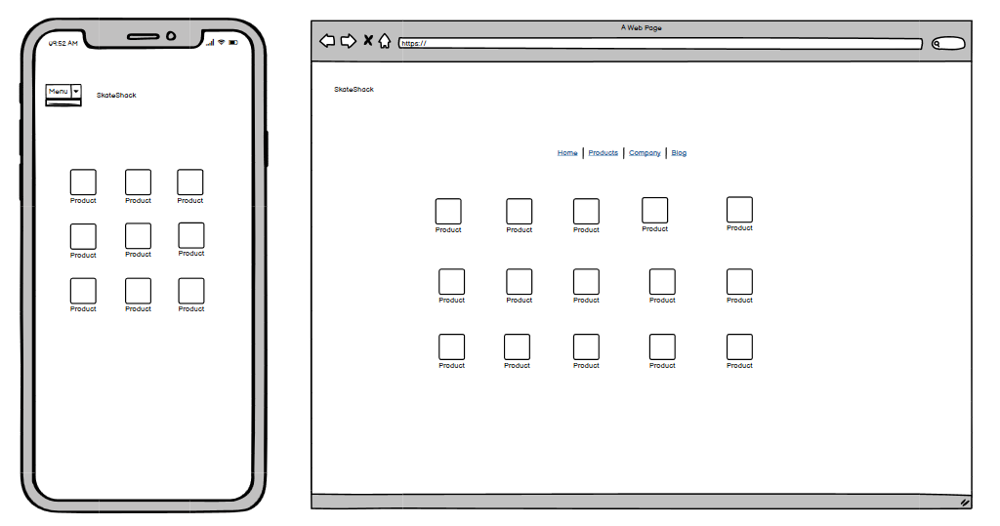
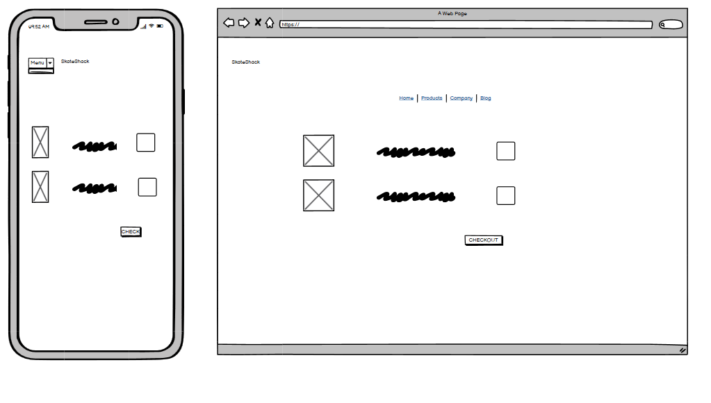

The color scheme of this project features a minimalist combination of black and white with hot pink accents. The black and white provide a classic and clean backdrop, while the hot pink adds an exciting accent to break up the monochrome.

The black and white colors are primarily used for text, backgrounds, and borders throughout the project. This creates a consistent and professional look that is easy to read and navigate. The hot pink accents are used sparingly to highlight important elements such as buttons, links, and headings. This helps draw the user's attention to these key areas and creates a sense of excitement and energy.

Overall, the color scheme strikes a balance between simplicity and vibrancy that suits the project's style and tone. It adds signature without overwhelming the user or distracting from the content.


## Search Engine Optimisation

- Using the online SEO helper wordtracker, the follwing words were added to the keywords tag. 

- skate shop
- skateboarding
- complete skateboard
- decks
- trucks
- wheels
- beginner skate
- best skateboarding
- online skate shop

# Business Model

## Company description
The Skateshop is a B2C company that specializes in providing high-quality skateboarding equipment and accessories. We are committed to providing the best products for our customers, with a focus on durability, functionality, and style. Our goal is to provide an exceptional shopping experience for skateboarders of all levels, from beginners to professionals.

## Customers
Our target customers are skateboarders of all ages and skill levels. We cater to those who have a passion for skateboarding and are looking for high-quality equipment that can help them improve their skills.

## Competitors
We have several competitors in the skateboarding industry, including big box retailers, other specialty skate shops, and online retailers. However, we differentiate ourselves by providing a seamless shopping experience and a quality selection of products that meet the needs of our customers.

## SWOT analysis
### Strengths

- Wide range of high-quality skateboarding equipment and accessories.
- Seamless shopping experience.

### Weaknesses

- New brand in a competitive market.
- Limited marketing budget.

### Opportunities

- Growing demand for skateboarding equipment and accessories.
- Partnering with local skateboarding communities and events.
- Expanding our product line to include related products and services.

### Threats

- Competition from other skateboarding retailers.
- Changing consumer preferences and trends.
- Economic downturns affecting consumer spending.

## Marketing Strategy
Our marketing strategy includes leveraging social media platforms like Instagram, Twitter, and Facebook to engage with our customers and showcase new products. We will also offer promotions and discounts to encourage repeat business and referrals. Additionally, we will focus on providing exceptional customer service to ensure our customers have a positive shopping experience and become loyal, repeat customers.


## Features

### General

- Every page has access to the navigation bar with navigation to every product type etc.

- Every page has access to viewing the total in a customer's basket.

- Theres is a footer on every page.

- There is a drop down menu to access a user's profile as well as their wishlist and reviews that they have submitted.

- The header features on every page and changes based on the size of the user's screen.


### Home Page

- The home page is layed out with two relevant images and a link to the products page.

- It has a paragraph describing the site in accordance with SEO.

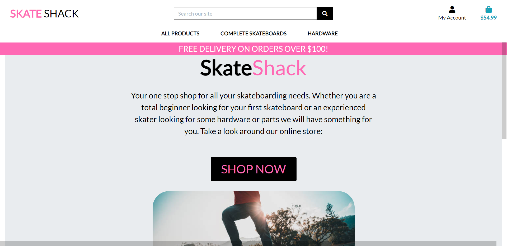

### Products Page

- Products are laid out simply with each product having its own information

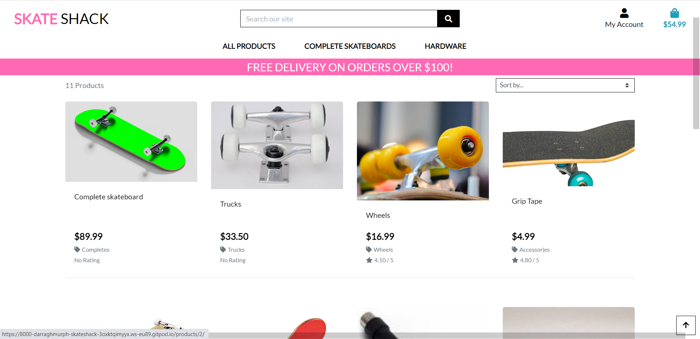

### Product Details Page

- The product detail page shows the selected product in more information.

- On this page there are buttons to add an item to bag, wishlist or write a review. 

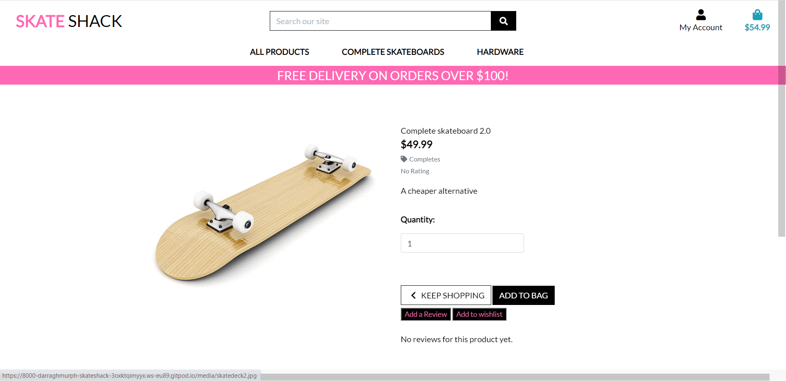

### Products Admin

- a form for an admin user to edit or create products. 


### Shopping Bag Page

- The shopping bag page displays the items the user has placed in their bag.

- This can be edited or deleted

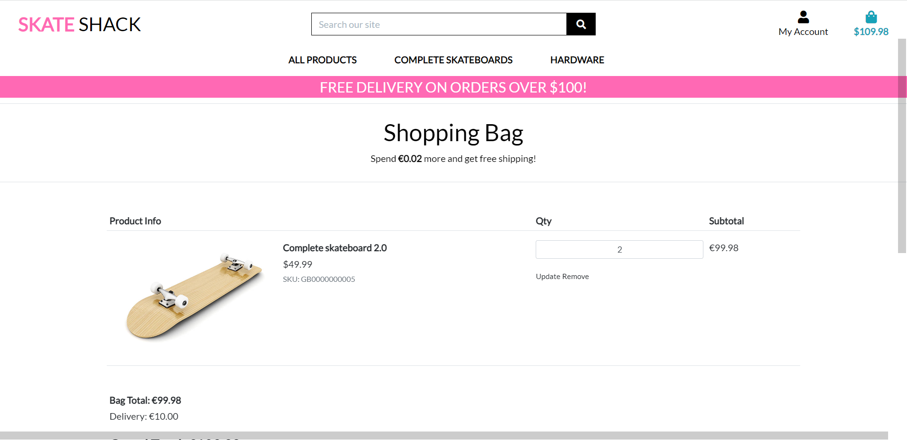

### Checkout Page

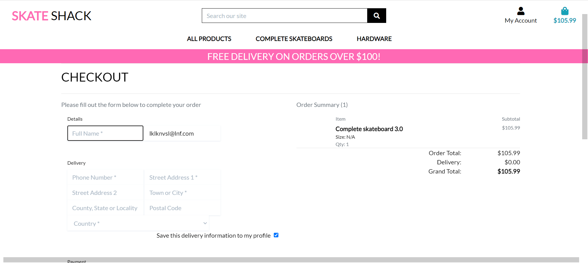

### Profile Page

- Profile page contains recent orders and delivery information.

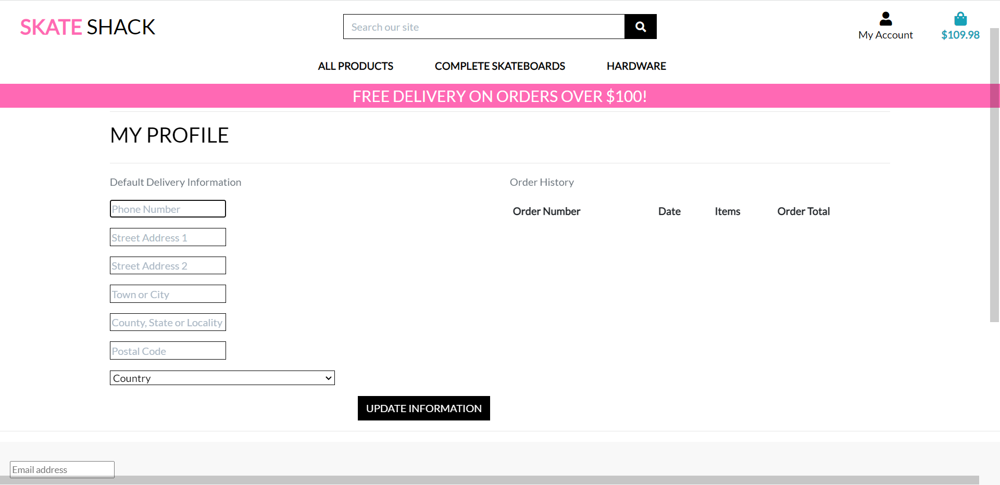

### Wishlist Page

- Describe the layout and content of the user favorites page.

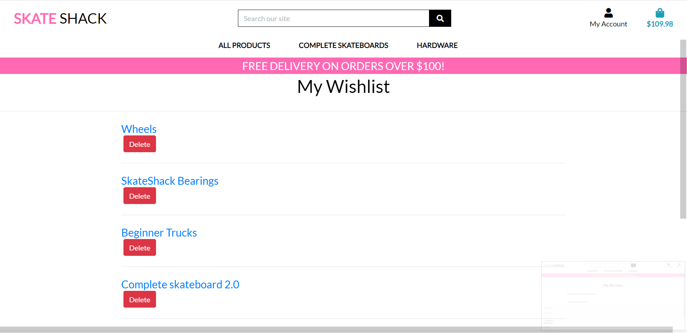

### Reviews Page

- Displays the user's wishlist with a link to product and a delete button.

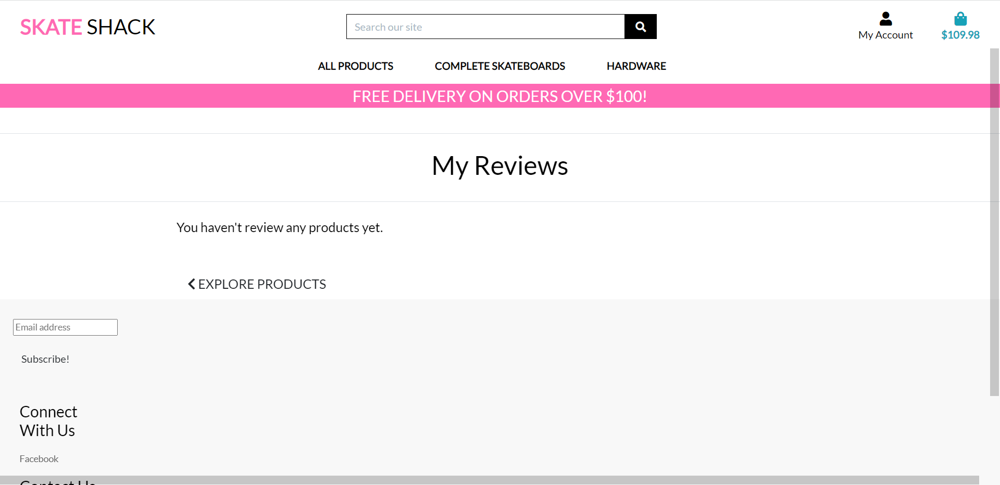

### Accounts Pages

- The log in/out pages as well as registration contain django forms.

### 404 Error Page

- Simple 404 message in the style of the site

## Technologies Used

### Languages Used

HTML5
CSS3
JavaScript
Python

### Libraries and Frameworks

Django was used as web framework.

Django Template was used as a templating language for Django to display backend data to HTML.

Bootstrap 5 was used throughout the website to help with styling and responsiveness.

Google Fonts was used to import the font into the html file, and were used on all parts of the site.

Font Awesome was used throughout the website to add icons for aesthetic and UX purposes.

### Packages / Dependencies Installed

Django Allauth was used for user authentication, registration, and account management.

Django Crispy Form was used to control the rendering of the forms.

Django Countries was used to provide country choices for use with forms and a country field for models.

Pillow was used to add image processing capabilities.

Gunicorn was used as Python WSGI HTTP Server for UNIX to support the deployment of Django application.

### Database Management

- elephantSQL

### Payment Service

- Stripe used for handling payments

### Cloud Storage

- Amazon Web Services (AWS) used for static files

### Tools and Programs

- GitHub
- GitPod
- Balsamiq Wireframes
- Google Chrome DevTools
- W3C Markup Validator.
- W3C CSS Validator
- JShint 
- Heroku

## Testing

### General Testing

Element | Expected Outcome | Pass/Fail |
--- | --- | --- |
My Account Icon - Register Link | Clicking the link redirects to the account sign up page. | Pass |
My Account Icon - Login Link | Clicking the link redirects to the account sign in page. | Pass |
My Account Icon - Logout link | Clicking the link redirects to the account sign out page. | Pass |
My Account Icon - Product Management Link | Clicking the link redirects to the add product page. | Pass |
My Account Icon - My Profile Link | Clicking the link redirects to the profile page. | Pass |
My Account Icon - My Reviews Link | Clicking the link redirects to the reviews page. | Pass |
Shopping Cart Icon | Clicking the link redirects to the shopping cart. | Pass |
Search Bar | Clicking the link redirects to the products page and display the matching products. | Pass |
Facebook Icon | Clicking the link open the business Facebook page on a separate tab. | Pass |

### Homepage Testing 

Element | Expected Outcome | Pass/Fail |
--- | --- | --- |
Categories Links | Clicking any of the links will redirect to the products page and filter the products on that category. | Pass |
Product Navigation Bar Links | All links work successfully | Pass
Shop Now Button | Brings user to products | Pass

### Product Detail/Products Testing 

Element | Expected Outcome | Pass/Fail |
--- | --- | --- |
Product Image | Clicking the image opens it on a separate tab. | Pass |
Wishlist button | Successfully adds to wishlist | Pass |
Product Edit Link | Opens edit product form. | Pass |
Product Delete Link | Deletes item successfully | Pass |
Keep Shopping Button | Sucesfully brings back to product. | Pass |
Add To Bag Button | Adds item to basket | Pass |
Sort By Selector | Sorts items according to sorting preference | Pass |
Review Edit Link | Enters edit review form | Pass |
Review Delete Link | Successfully deletes review | Pass |
Leave A Review Button | Enters the review form | Pass |


### Wishlist Testing 

Element | Expected Outcome | Pass/Fail |
--- | --- | --- |
Product Link | Links to item. | Pass |
Delete | Deletes item from wishlist | Pass |

### Review Testing 

Element | Expected Outcome | Pass/Fail |
--- | --- | --- |
Product Link | Clicking the link redirect to the product details page. | Pass |
Edit Link | Clicking the link redirect to the edit review page. | Pass |
Delete Link | Clicking the link deletes the review | Pass |
Add Review Form | Review added | Pass |
Cancel Button | successfully cancels review | Pass |
Edit Review Form | Review edited | Pass |
Cancel Button | successfully cancels review | Pass |

### Bag Testing 

Element | Expected Outcome | Pass/Fail |
--- | --- | --- |
Edit Quantity | Whatever number is displayed in the box is added to bag | Pass |
Update Link | Updates quantity | Pass
Delete Link | Deletes item | Pass
Keep Shopping Button | Redirects the user | Pass |
Secure Checkout Button | Redirects to checkout. | Pass |

### Checkout Testing 

### Profile Testing

Element | Expected Outcome | Pass/Fail |
--- | --- | --- |
Update Information Form | User's information gets updated when submitting the form. | Pass |
Order Link | Clicking the link redirects to order view. | Pass |

### Newsletter Testing 

Element | Expected Outcome | Pass/Fail |
--- | --- | --- |
Add Subscriber | User is added to newsletter list | Pass |

### Log In/Out, Registration

Element | Expected Outcome | Pass/Fail |
--- | --- | --- |
Log In page | User successfully logs into the site | Pass |
Log out page | User successfully logs out of the site | Pass |
Create Account | User successfully creates account for the site | Pass |


### Product Admin

Element | Expected Outcome | Pass/Fail |
--- | --- | --- |
Add Product Form | Product is added | Pass |
Cancel Button | Cancel button exits form | Pass |
Edit Product Form | Product is edited | Pass |
Cancel Button | Cancel button exits form | Pass |

### Code Validation 

Passes through jshint, css and html validators W3. Python passed through gitpod.

### Lighthouse 


## Deployment


### Deployment to Heroku 
This project is deployed on Heroku for production, with all static and media files stored on AWS S3. These are steps to deploy on Heroku:

1. Navigate to Heroku.com, create a new account or login if you already have an account. On the dashboard page, click "Create New App" button. Give the app a name, the name must be unique with hypens between words. Set the region closest to you, and click "Create App".   
2. On the resources tab, provision a new Heroku Postgres database.  
3. Configure variables on Heroku by navigating to Settings, and click on Reveal Config Vars. You may not have all the values yet. Add the others as you progress through the steps.   
   Varables | Key   
   ---| ---   
   AWS_ACCESS_KEY_ID | your_access_key_id_from_AWS   
   AWS_SECRET_ACCESS_KEY | your_secret_access_key_from_AWS  
   DATABASE_URL | your_database_url   
   EMAIL_HOST_PASS | your_app_password_from_your_email   
   EMAIL_HOST_USER | your_email_address  
   SECRET_KEY | your_secret_key 
   STRIPE_PUBLIC_KEY | your_stripe_public_key  
   STRIPE_SECRET_KEY | your_stripe_secret_key  
   USE_AWS | True 

4. If you haven't install it, install dj_database_url and psycopg2.
   ```
   pip3 install dj_database_url
   pip3 install psycopg2-binary
   ```
   Note: you don't have to do this if you've installed all dependencies in the requirements.txt file.  
5. Set up a new database for the site by going to the project's settings.py and importing dj_database_url. Comment out the database's default configuration, and replace the default database with a call to dj_database_url.parse and pass it the database URL from Heroku (you can get it from your config variables in your app setting tab)
   ```
   DATABASES = {
     'default': dj_database_url.parse('YOUR_DATABASE_URL_FROM_HEROKU')
   }
   ```
6. Run migrations
   ```
   python3 manage.py migrate
   ```  
7. Import data to the database.
    - Make sure your manage.py file is connected to your sqlite3 database.
    - Use this command to backup your current database and load it into a db.json file:
    ```
    ./manage.py dumpdata --exclude auth.permission --exclude contenttypes > db.json
    ```
    - Connect your manage.py file to your postgres database
    - Then use this command to load your data from the db.json file into postgres:
    ``` 
    ./manage.py loaddata db.json
    ``` 
8. Set up a new superuser, fill out the username, email address, and password.
   ```
   python3 manage.py create superuser
   ```  
9. Remove the database config from Heroku and uncomment the original config. Add a conditional statement to define that when the app is running on Heroku. we connect to Postgres, and otherwise, we connect to Sqlite.   
   ```
   if 'DATABASE_URL' in os.environ:
      DATABASES = {
         'default': dj_database_url.parse(os.environ.get('DATABASE_URL'))
      }
   else:
      DATABASES = {
         'default': {
            'ENGINE': 'django.db.backends.sqlite3',
            'NAME': BASE_DIR / 'db.sqlite3',
         }
      }
   ```  
10. Install gunicorn which will act as the webserver, and put it on the requirements.txt.   
   ``` 
   pip3 install gunicorn
   pip3 freeze > requirements.txt
   ```
   Note: you don't have to do this if you've installed all dependencies in the requirements.txt file.
11. Create a Procfile, to tell Heroku to create a web dyno, which will run unicorn and serve the Django app.   

   Inside the Procfile:
   ```
   web: gunicorn shoes_and_more.wsgi:application
   ```
12. Login to Heroku through CLI, using ```heroku login```. Once logged in, disable the collect static temporarily, so that Heroku won't try to collect static files when it deploys.
   ```
   heroku config:set DISABLE_COLLECTSTATIC=1 --app shoes-and-more
   ```
   And add the hostname of the Heroku app to allowed hosts in the project's settings.py, and also add localhost so that Gitpod will still work as well:  
   ```
   ALLOWED_HOSTS = ['shoes-and-more.herokuapp.com', 'localhost']
   ```   
13. Add, commit, and push to gitpod and then to Heroku. After pushing to gitpod as usual, initialize git remote first:
   ```
   heroku git:remote -a shoes-and-more
   ``` 
   Then push to Heroku:
   ```
   git push heroku main
   ```
14. Go to the app's dashboard on Heroku and go to Deploy. Connect the app to Github by clicking Github and search for the repository. Click connect. Also enable the automatic deploy by clicking Enable Automatic Deploys, so that everytime we push to github, the code will automatically be deployed to Heroku as well.  
15. Go back to settings.py and replace the secret key setting with the call to get it from the environment, and use empty string as a default. 
   ```
   SECRET_KEY = os.environ.get('SECRET_KEY', '')
   ```
   Set debug to be true only if there's a variable called development in the environment.
   ```
   DEBUG = 'DEVELOPMENT' in os.environ
   ```
  

### AWS Bucket Creation   
All static and media files in this project are stored in [Amazon Web Services S3 bucket](https://aws.amazon.com/) which is a cloud based storage service. You can create your own bucket by following these steps:   
1. Go to [Amazon Web Service website](https://aws.amazon.com/) and click on Create An AWS Account, or login if you already have an account.  
2. Login to your new account, go to AWS Management Console and find service S3. Click on Create Bucket.   
   - Give it a name (I recommend naming your bucket to match the Heroku app name), and choose region closest to you.  
   - In Object Ownership section, choose ACLS enabled. and Bucket Owner Preffered.   
   - Uncheck box 'Block All Public Access'.  
   - Check box 'I acknowledge that the current settings might result in this bucket and the objects within becoming public.'  
   - Click on Create Bucket, and your bucket is created.  
3. Click on your newly created bucket, and navigate to the Properties tab. Scroll down to the bottom until you find Static Website Hosting. Click on Edit, then enable. 
   - Hosting type: choose Host a Static Website   
   - Index document: index.html  
   - Error document: error.html
   - Click on Save Changes.  
4. Navigate to the Permissions tab. Scroll down to the bottom until you find Cross-origin resource sharing (CORS). Click on Edit, and paste in this Cors Configuration below, which is going to set up the required access between the Heroku app and this S3 bucket. Click on Save Changes. 
   ```
   [
      {
         "AllowedHeaders": [
            "Authorization"
         ],
         "AllowedMethods": [
            "GET"
         ],
         "AllowedOrigins": [
            "*"
         ],
         "ExposeHeaders": []
      }
   ]
   ```   
   Still on the Permissions tab, find Bucket policy, click on Edit, and then go to Policy Generator. 
   - Select Type of Policy: choose S3 Bucket Policy   
   - Effect: choose Allow   
   - Principal: *   
   - Actions: select GetObject   
   - Fill in the Amazon Resource Name (ARN), from the Bucket ARN back in the Bucket Policy   
   - Click on the Add Statement and then Generate Policy. Copy the policy and paste in the bucket policy editor.  
   - Add a slash star on to the end of the resource key (because we want to allow access to all resources in this bucket). Click Save.
      The resource key should look like this
      ```  
      "Resource": "arn:aws:s3:::YOUR_BUCKET_NAME/*",  
      ```  
   
   Still on Permissions tab, go to Access Control List (ACL) section, click Edit and enable List for Everyone (public access), and accept the warning box.  

5. With the bucket ready, now we need to create a user to access it through another service called IAM which stands for Identity and Access Management. Go back to the service menu and open IAM.   
   a. Create a group for our user to live in.  
      Click User Groups, and then create a new group with a name you want. I gave the group the name: manage-shoes-and-more. Scroll down to the bottom and click on Create Group.     
   b. Create an access policy giving the group access to the S3 bucket that has been created.  
      - Click on Policy, and then Create Policy. Go to the JSON tab, and then select import managed policy, which will let us import one that AWS has pre-built for full access to S3. Search for S3, then import the AmazonS3FullAccess policy.   
      - Because we only want to allow full access to our new bucket and everything within it, paste the bucket ARN (from the bucket policy page in s3) in the JSON editor.
      ```
      "Resource": [
         "arn:aws:s3:::YOUR_BUCKET_NAME",
         "arn:aws:s3:::YOUR_BUCKET_NAME/*"
      ]
      ```  
      Now click on Next:Tags, then click Next:Review. 
      - Give the review policy a name and a description, then click Create Policy. The policy has now been created. 
      
   c. Finally, assign the user to the group so it can use the policy to access all our files.  
      - Go to User Groups, and select the group. Go to the Permissions tab, open the Add Permissions dropdown, and click Attach Policies.  
      - Select the policy and click Add permissions at the bottom.  
      - Create a user to put in the group, by going to the Users page, and clicking Add Users.  
      - Set a user name, give them access type: Programmatic access, and then click Next: Permissions.   
      - Check on the group that has the policy attached. Click Next: Tags, then click Next: Review, and lastly Create User.     
      - Download the csv file and save it.  


### Connect Django to AWS Bucket 
Note: If you've forked the repository, all of these steps are already done/ written on the files. Make sure you've installed all dependencies in the requirements.txt file, add all the AWS-related Config Vars to Heroku, and remove the DISABLE_COLLECTSTATIC variable from Heroku.   
Here are the steps I took to connect Django to AWS:  
1. Install two new packages: boto3 and django-storages. Freeze them into requirements.txt.   
   ```
   pip3 install boto3
   pip3 install django-storages 
   pip3 freeze > requirements.txt  
   ```  
2. Add storages to the Installed Apps in settings.py.
3. In settings.py, we need to set cache control, set bucket configurations, set static and media files location, and override static and media URLs in production. We'll only want to do this on Heroku, so add an if statement as well.
   ```
   if 'USE_AWS' in os.environ:
      # Cache control
      AWS_S3_OBJECT_PARAMETERS = {
         'Expires': 'Thu, 31 Dec 2099 20:00:00 GMT',
         'CacheControl': 'max-age=94608000',
      }

      # Bucket Config
      AWS_STORAGE_BUCKET_NAME = 'YOUR_BUCKET_NAME'
      AWS_S3_REGION_NAME = 'YOUR_REGION'
      AWS_ACCESS_KEY_ID = os.environ.get('AWS_ACCESS_KEY_ID')
      AWS_SECRET_ACCESS_KEY = os.environ.get('AWS_SECRET_ACCESS_KEY')
      AWS_S3_CUSTOM_DOMAIN = f'{AWS_STORAGE_BUCKET_NAME}.s3.amazonaws.com'

      # Static and media files
      STATICFILES_STORAGE = 'custom_storages.StaticStorage'
      STATICFILES_LOCATION = 'static'
      DEFAULT_FILE_STORAGE = 'custom_storages.MediaStorage'
      MEDIAFILES_LOCATION = 'media' 

      # Override static and media URLs in production
      STATIC_URL = f'https://{AWS_S3_CUSTOM_DOMAIN}/{STATICFILES_LOCATION}/'
      MEDIA_URL = f'https://{AWS_S3_CUSTOM_DOMAIN}/{MEDIAFILES_LOCATION}/'
   ```
   Set the Config Vars on Heroku. On your app's dashboard on Heroku, go to Settings and click Reveal Convig Vars. Set this variables:
   Variables | Value
   --- | ---
   AWS_ACCESS_KEY_ID | your access key id from the csv file that you've downloaded before
   AWS_SECRET_ACCESS_KEY | your secret access key from the csv file that you've downloaded before
   USE_AWS | True    

   Also remove the COLLECTSTATIC variable from the Config Vars.   

4. We then want to tell Django that in production we want to use S3 to store our static files whenever someone runs collectstatic, and that we sent any uploaded images to go there as well.  
Create a custom_storages.py file in your project's root directory, and inside it, include the Static and Media Storage locations: 
   ```
   from django.conf import settings
   from storages.backends.s3boto3 import S3Boto3Storage
 

   class StaticStorage(S3Boto3Storage):
      location = settings.STATICFILES_LOCATION


   class MediaStorage(S3Boto3Storage):
      location = settings.MEDIAFILES_LOCATION
   ```  

5. Finally, push these changes on Github.
   ```
   git add .
   git commit -m "Your commit message"
   git push
   ```


## Known Bugs

- Wishlist item appears with a dropdown box despite not making a difference what product is selected.

## Acknowledgements

- Code Institute 

- Marcel Mulders 

- Booutique Ado Walkthrough 

- Stack Overflow
